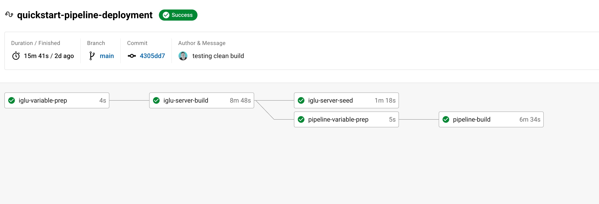

<div id="top"></div>
<!--
*** Thanks for checking out the Best-README-Template. If you have a suggestion
*** that would make this better, please fork the repo and create a pull request
*** or simply open an issue with the tag "enhancement".
*** Don't forget to give the project a star!
*** Thanks again! Now go create something AMAZING! :D
-->


<!-- PROJECT SHIELDS -->
<!--
*** I'm using markdown "reference style" links for readability.
*** Reference links are enclosed in brackets [ ] instead of parentheses ( ).
*** See the bottom of this document for the declaration of the reference variables
*** for contributors-url, forks-url, etc. This is an optional, concise syntax you may use.
*** https://www.markdownguide.org/basic-syntax/#reference-style-links
-->
[](https://circleci.com/gh/gthomson31/Snowplow-QuickStart-CircleCI/tree/main)
<!-- PROJECT LOGO -->

<br />
<div align="center">
  <h2 align="center">Snowplow Quickstart AWS Default - CircleCI</h2>
  <p align="center">
    Automate that deployment!
    <br />
    <a href="https://docs.snowplowanalytics.com/docs/open-source-quick-start/"><strong>Snowplow QuickStart Guide deployment quide»</strong></a>
    <br />
  </p>
</div>


<!-- TABLE OF CONTENTS -->
<details>
  <summary>Table of Contents</summary>
  <ol>
    <li>
      <a href="#about-the-project">About The Project</a>
      <ul>
        <li><a href="#built-with">Built With</a></li>
      </ul>
    </li>
    <li>
      <a href="#getting-started">Getting Started</a>
      <ul>
        <li><a href="#prerequisites">Prerequisites</a></li>
        <li><a href="#installation">Installation</a></li>
      </ul>
    </li>
    <li><a href="#usage">Usage</a></li>
    <li><a href="#roadmap">Roadmap</a></li>
    <li><a href="#contributing">Contributing</a></li>
    <li><a href="#license">License</a></li>
    <li><a href="#contact">Contact</a></li>
    <li><a href="#acknowledgments">Acknowledgments</a></li>
  </ol>
</details>
<br>


<!-- SNOWPLOW OVERVIEW  -->
# Snowplow Overview
Snowplow is an enterprise-strength marketing and product analytics platform. 
It does three things:

* Identifies your users, and tracks the way they engage with your website or application
* Stores your users' behavioral data in a scalable "event data warehouse" you control: Amazon Redshift, Google BigQuery, Snowflake or Elasticsearch
* Lets you leverage the biggest range of tools to analyze that data, including big data tools (e.g. Spark) via EMR or more traditional tools e.g. Looker, Mode, Superset, Re:dash to analyze that behavioral data

To find out more, please check out the [Snowplow Website](https://snowplowanalytics.com/) and the [docs](https://docs.snowplowanalytics.com/open-source-docs/) website.


<!-- ABOUT THE PROJECT -->
## About The Project



The aim of this project was to utilise automation using CircleCI to pull together the quickstart deployment templates into a reusable pipeline that could be forked and deployed quickly. 

Here's why:
* Speed up the time to deploy the quickstart pipeline.
* Using CircleCI as a CI/CD deployment method will allow you to deploy consistently.
* You should implement DRY principles to the rest of your life :smile:


<p align="right">(<a href="#top">back to top</a>)</p>


### Built With

* [AWS](https://aws.amazon.com/)
* [Snowplow Quickstart](https://github.com/snowplow/quickstart-examples)
* [CircleCI](https://circleci.com/)
* [Terraform](https://www.terraform.io/)

<p align="right">(<a href="#top">back to top</a>)</p>


<!-- GETTING STARTED -->
## Getting Started

In order to use this project effectivly you will first need to follow the prerequisites in order to setup your enviroment effectivly.

### Prerequisites

* AWS Account
* CircleCI Account
* Github Account
* Terraform ClI
  * Used Locally to deploy the prerequiste stack (Networking and DynamoDB table)

### Installation

# High Level Steps more Detail to follow 

1. Fork the github directory
2. Follow the project within CircleCI utilising the exisiting Config.yml file
3. Deploy the Prerequisite terraform stacks to deploy the required networks/dynamodb
4. Update the Terraform Versions terraform_files/(iglu/pipeline)versions.tf with dyanmoDB details
5. Create the following enviroment variables within CircleCI
  ```
    ALLOWED_IP	
    AWS_ACCESS_KEY_ID	
    AWS_DEFAULT_REGION
    AWS_SECRET_ACCESS_KEY	 
    IGLU_API_KEY	
    IGLU_DB_PASSWORD
    PREFIX
    PUBLIC_SUBNET_1	
    PUBLIC_SUBNET_2	
    S3_DATA_BUCKET
    SSH_PUBLIC_KEY
    VPC_ID
  ```
  Optional variable depending on AWS Deployment.
  ```
    IAM_PERMISSIONS_BOUNDRY
  ```

6. Commit and push your changes to kick of the deployment. 🚀


<p align="right">(<a href="#top">back to top</a>)</p>


<!-- USAGE EXAMPLES -->
## Usage

Use this space to show useful examples of how a project can be used. Additional screenshots, code examples and demos work well in this space. You may also link to more resources.

_For more examples, please refer to the [Documentation](https://example.com)_

<p align="right">(<a href="#top">back to top</a>)</p>


<!-- ROADMAP -->
## Roadmap

- [x] Create Initial AWS Default Iglu Deployment
- [x] Create Initial AWS Default Pipline Deployment
- [x] Add in Teardown Parameter to destroy the deployment
- [ ] DOCUMENNTATION!! 
- [ ] Create Initial GCP Default Iglu Deployment
- [ ] Create Initial GCP Default Pipline Deploymente
- [ ] Additional Outputs for Prequisites
- [ ] Create Secure deployment updates
- [ ] Add additional modifications to allow for further automation.

<p align="right">(<a href="#top">back to top</a>)</p>

<!-- CONTRIBUTING -->
## Contributing

Contributions are what make the open source community such an amazing place to learn, inspire, and create. Any contributions you make are **greatly appreciated**.

If you have a suggestion that would make this better, please fork the repo and create a pull request. You can also simply open an issue with the tag "enhancement".
Don't forget to give the project a star! Thanks again!

1. Fork the Project
2. Create your Feature Branch (`git checkout -b feature/AmazingFeature`)
3. Commit your Changes (`git commit -m 'Add some AmazingFeature'`)
4. Push to the Branch (`git push origin feature/AmazingFeature`)
5. Open a Pull Request

<p align="right">(<a href="#top">back to top</a>)</p>


<!-- LICENSE -->
## License

Distributed under the MIT License. See `LICENSE.txt` for more information.

<p align="right">(<a href="#top">back to top</a>)</p>


<!-- CONTACT -->
## Contact

Your Name - [@gregthomson31](https://twitter.com/gregthomson31) - greg.thomson@snowplowanalytics.com <br>
Project Link: [https://github.com/gthomson31/Snowplow-QuickStart-CircleCI](Snowplow-QuickStart-CircleCI)

<p align="right">(<a href="#top">back to top</a>)</p>


<!-- LINKS -->
## Further Snowplow links

* [snowplow-bdp]
* [version-compatibility]
* [try-snowplow]
* [request-a-demo]
* [roadmap]
* [open-source-quick-start]
* [terraform-modules]
* [research-survey]


<p align="right">(<a href="#top">back to top</a>)</p>


<!-- MARKDOWN LINKS & IMAGES -->
<!-- https://www.markdownguide.org/basic-syntax/#reference-style-links -->

[website]: https://snowplowanalytics.com
[docs]: https://docs.snowplowanalytics.com/open-source-docs/

[snowplow-bdp]: https://snowplowanalytics.com/products/snowplow-bdp/
[version-compatibility]: https://docs.snowplowanalytics.com/docs/pipeline-components-and-applications/version-compatibility-matrix/
[try-snowplow]: https://try.snowplowanalytics.com/?utm_source=github&utm_medium=post&utm_campaign=try-snowplow
[request-a-demo]: https://go.snowplowanalytics.com/l/571483/2021-05-04/3sv1pg8
[roadmap]: https://github.com/snowplow/snowplow/projects
[open-source-quick-start]: https://docs.snowplowanalytics.com/docs/open-source-quick-start/
[terraform-modules]: https://registry.terraform.io/modules/snowplow-devops
[research-survey]: https://forms.gle/pCtYx8naum7A8vvw5

[architecture-image]: media/snowplow_architecture.png
[architecture]: ./ARCHITECTURE.md


[javascript-tracker]: https://github.com/snowplow/snowplow-javascript-tracker
[amp-tracker]: https://docs.snowplowanalytics.com/docs/collecting-data/collecting-from-own-applications/google-amp-tracker/
[android-tracker]: https://github.com/snowplow/snowplow-android-tracker
[ios-tracker]: https://github.com/snowplow/snowplow-objc-tracker
[rn-tracker]: https://github.com/snowplow-incubator/snowplow-react-native-tracker
[roku-tracker]: https://github.com/snowplow-incubator/snowplow-roku-tracker
[flutter-tracker]: https://github.com/snowplow-incubator/snowplow-flutter-tracker
[tracking-cli]: https://github.com/snowplow/snowplow-tracking-cli
[dotnet-tracker]: https://github.com/snowplow/snowplow-dotnet-tracker
[golang-tracker]: https://github.com/snowplow/snowplow-golang-tracker
[java-tracker]: https://github.com/snowplow/snowplow-java-tracker
[php-tracker]: https://github.com/snowplow/snowplow-php-tracker
[python-tracker]: https://github.com/snowplow/snowplow-python-tracker
[ruby-tracker]: https://github.com/snowplow/snowplow-ruby-tracker
[scala-tracker]: https://github.com/snowplow/snowplow-scala-tracker
[unity-tracker]: https://github.com/snowplow/snowplow-unity-tracker
